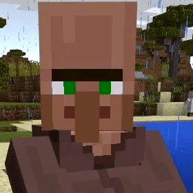
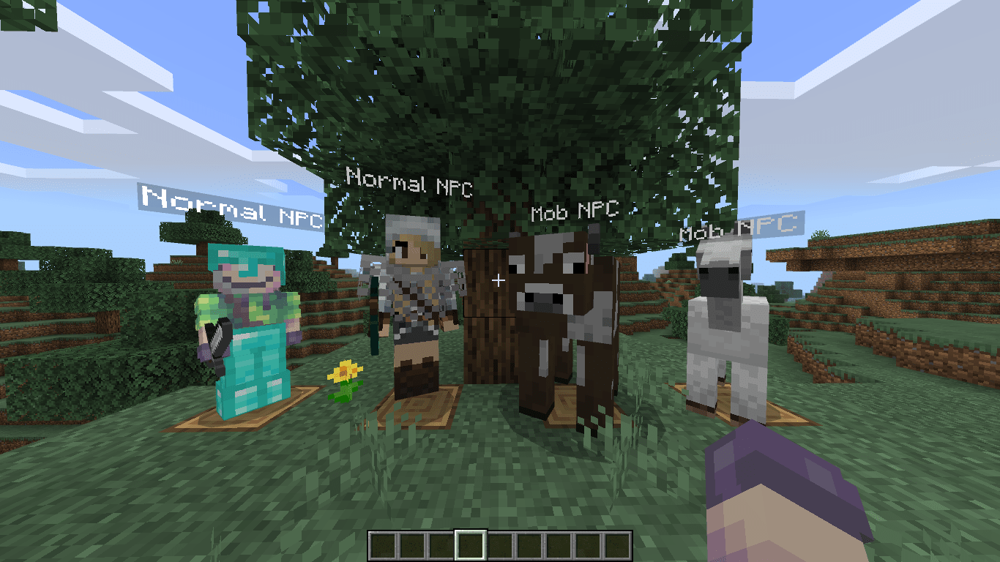
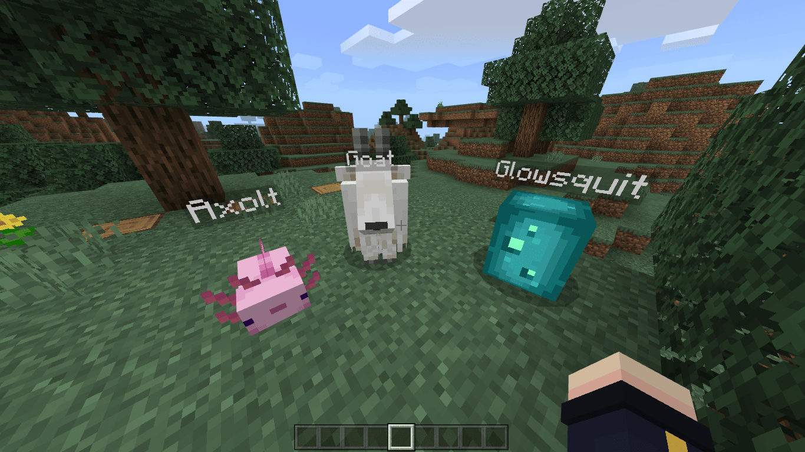

<h1>SimpleNPC</h1><br>

<b>An Ultimate NPC plugin made by brokiem for PocketMine-MP.</b><br>
[](https://github.com/brokiem/SimpleNPC)
[](https://github.com/brokiem/SimpleNPC/stargazers)
[](https://discord.com/invite/jy6abSrjhQ)
[](https://www.paypal.me/brokiem)
[](https://patreon.com/brokiem)
[](https://poggit.pmmp.io/p/SimpleNPC)

## ✨ Features

- Right click to interact! ✔
- NPC can walk! ✔
- Set NPC skin with URL! ✔
- Register your own entity! ✔
- NPC with custom data saving! ✔
- NPC with Cape supported! ✔
- NPC with Custom Geometry! ✔
- Edit NPC with UI/Form! ✔
- NPC without nametag ✔
- Custom NPC Size/Scale ✔
- Live updates without restart ✔
- Cooldown for commands ✔
- NPC can look at players ✔
- Lightweight & Open Source ❤

## 💬 Commands

<b>For more command info, please look directly at ```/snpc help```</b><br> or you can use <b>```/snpc ui```</b><br>

| Command | Description | Permission | Default |
| --- | --- | --- | --- |
| ```/snpc``` | ```SimpleNPC command list``` | ```none``` | ```true``` |
| ```/snpc ui``` | ```Manage npc with UI/Form``` | ```simplenpc.ui``` | ```op``` |
| ```/snpc spawn``` | ```Spawn an npc``` | ```simplenpc.spawn``` | ```op``` |
| ```/snpc edit``` | ```Edit the npc``` | ```simplenpc.edit``` | ```op``` |
| ```/snpc id``` | ```Get the npc id``` | ```simplenpc.id``` | ```op``` |
| ```/snpc reload``` | ```Reload plugin config``` | ```simplenpc.reload``` | ```op``` |
| ```/snpc remove``` | ```Remove the npc``` | ```simplenpc.remove``` | ```op``` |
| ```/snpc list``` | ```See the npc list``` | ```simplenpc.list``` | ```op``` |

## 📝 Todo List

- Add custom walking path

## ❔ Issues

Did you find a bug or error when using this plugin? feel free to open the
issues [here](https://github.com/brokiem/SimpleNPC/issues/new)

## 🖥 Developers

If you want to register your own entity, take a look at
this [plugin](https://github.com/brokiem-pm-pl/CustomEntity/tree/pm4)<br>
You can also customize NPCs geometry by customizing the NPC skins

## 👑 Donation

Patreon - https://www.patreon.com/join/brokiem <br>
Saweria - https://saweria.co/brokiem

## 🖼 Images



